# Run demo

[toc]


```bash
git clone https://github.com/GoogleCloudPlatform/microservices-demo.git
```


```bash
brew install kubectl
```

delete all the previous files

```bash
brew install skaffold
kubectl delete pods --all
docker stop $(docker ps -aq)
docker rm $(docker ps -aq)
docker rmi -f $(docker images -q)
```


Add support for Kubernetes in Docker desktop

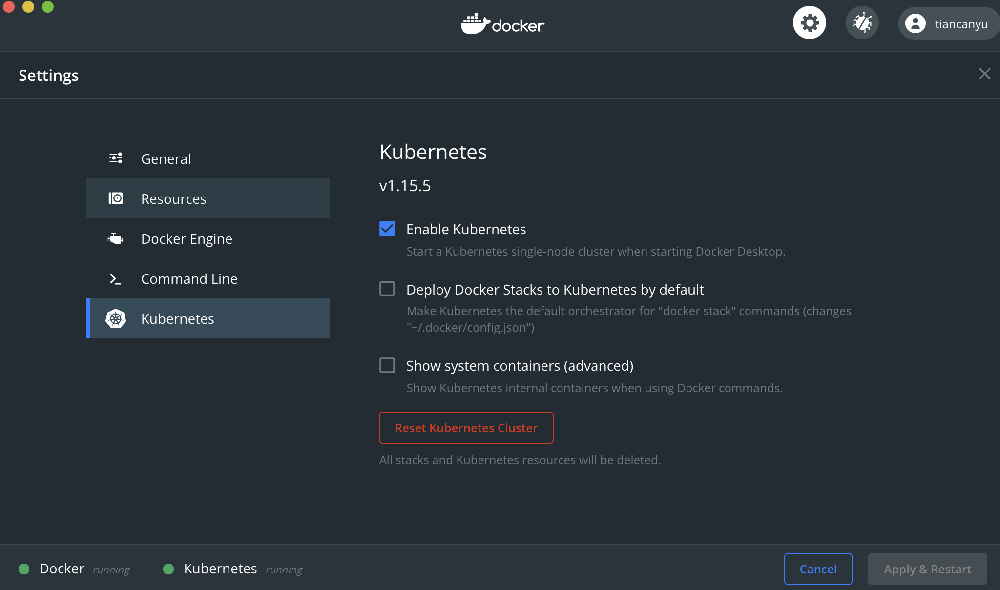


```bash
kubectl get nodes
```

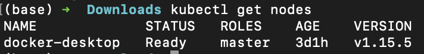

```bash
curl -L https://istio.io/downloadIstio | sh -
```


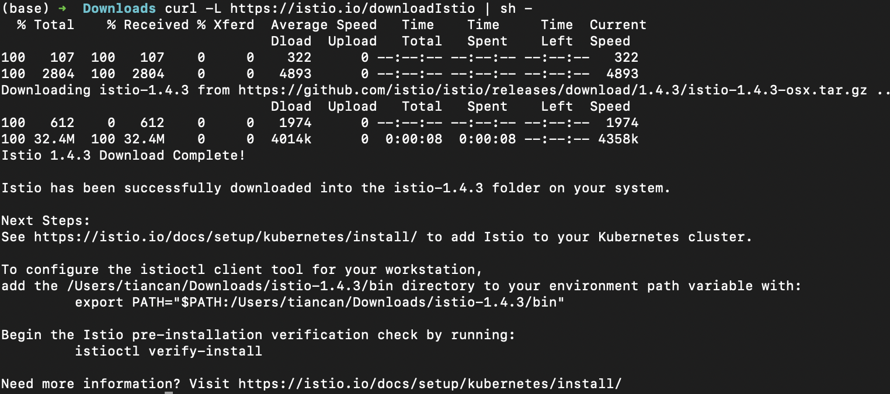


```bash
cd istio-1.4.3
```


```bash
export PATH=$PWD/bin:$PATH
```


```bash
istioctl version
istioctl manifest generate --set profile=demo | kubectl delete -f -
istioctl manifest apply --set profile=demo
```

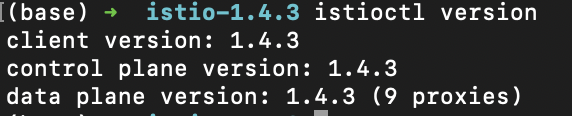

```bash
kubectl get svc -n istio-system
```

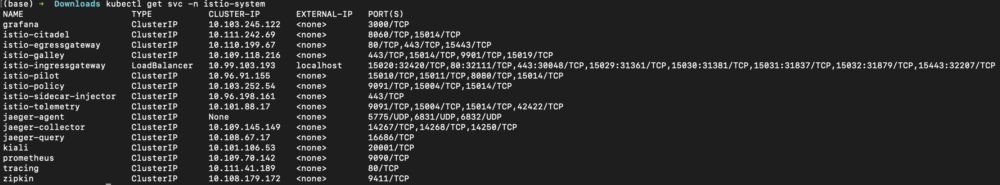


```bash
kubectl label namespace default istio-injection=enabled
```


```bash
kubectl apply -f ./istio-manifests
```


```bash
skaffold run
```

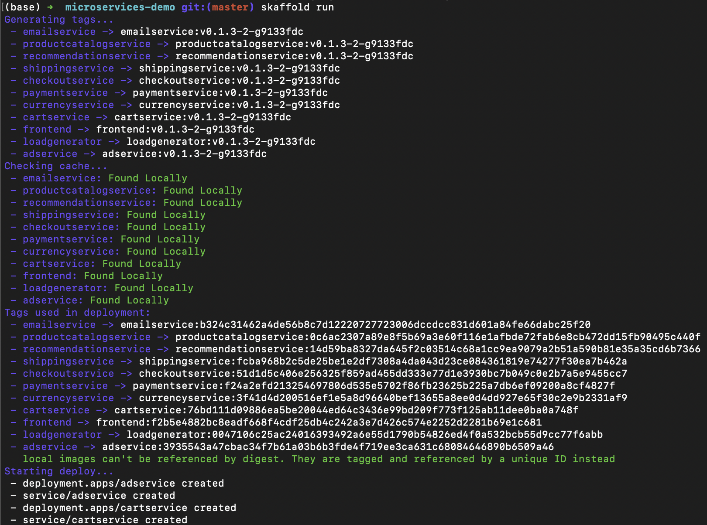

```
kubectl get pods
```

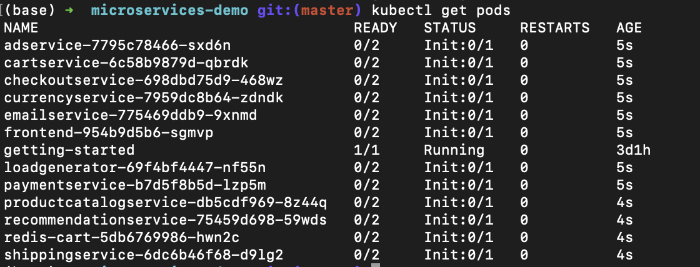

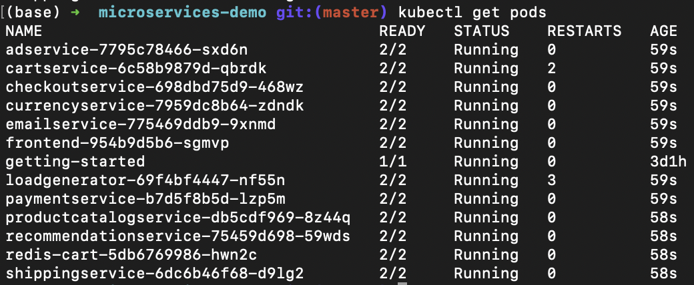

```bash
kubectl -n istio-system get service istio-ingressgateway
```

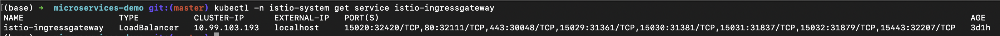

```bash
INGRESS_HOST="$(kubectl -n istio-system get service istio-ingressgateway \
   -o jsonpath='{.status.loadBalancer.ingress[0].hostname}')"
```

```bash
echo "$INGRESS_HOST"
```

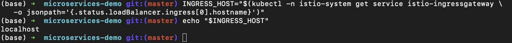


```bash
skaffold delete
```


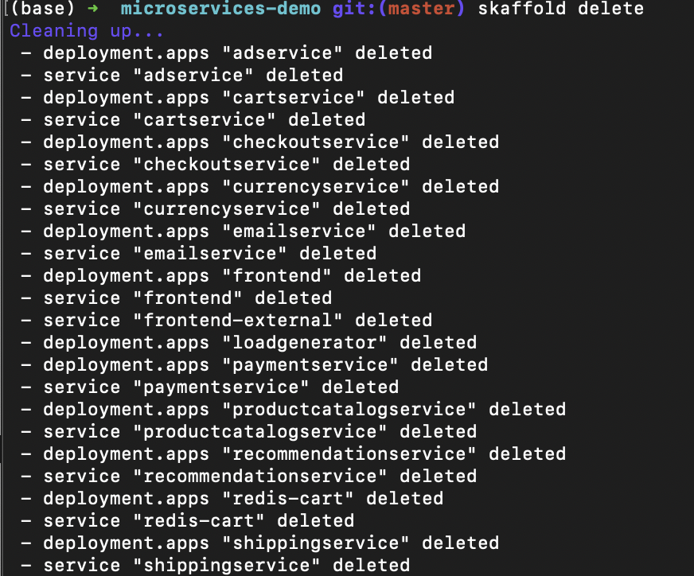

